```{r setup, include=FALSE}
knitr::opts_chunk$set(
	echo = TRUE,
	warning = FALSE,
	comment = "##",
	prompt = TRUE,
	tidy = TRUE,
	tidy.opts = list(width.cutoff = 75),
	fig.path = "img/"
)
```
    
# An introduction to PCA

## Preliminaries
- Install this packages in ***R***: {HSAUR} (the .rmd won't knit without this)

## Objectives
> In this module we will examine Principal Component Analysis, a method for analysing continuous multivariate datasets. We will learn what PCAs can be used for, will walk though a basic version by hand in R, and will finally run an analysis together using real world data. 
Key concepts: 
**Principle components**, 
**Eigenvectors**, 
**Eigenvalues**, 
**Loading**. 

## The basics  
*This module can be found at: https://github.com/maydixon/PCA_module*
   
**Principal Component Analysis** or **PCA** is a common  statistical technique that helps to describe relationships in data without losing variation. PCA's are good tools for : 

* Visualizing multivariate data

* Finding the correlations between variables in multivariate data

* Demonstrating the most important sources of variance in your data

* Reducing highly dimensional data into fewer, more managable or visualizable dimensions

* De-correlating variables

* Often an intermediate step used to reveal associations between variables
   
##### Conceptual underpinnings

PCA can be thought of as creating natural axes that fit the data and describe it. 

**[Drawing a toy version on the board]**

How we normally plot our data, with our variables as axes (Fig 1A), and the same data rotated so that PC1 and PC2 are the axes (Fig 1B):

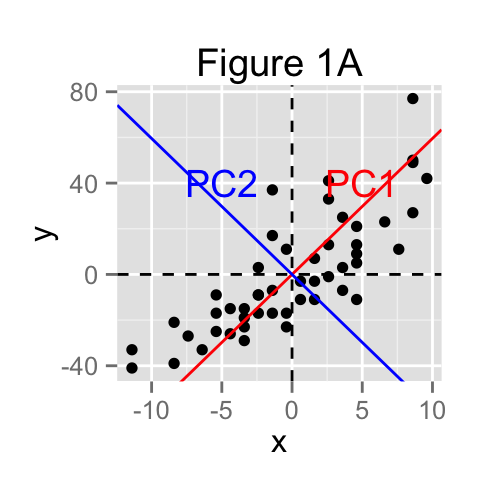
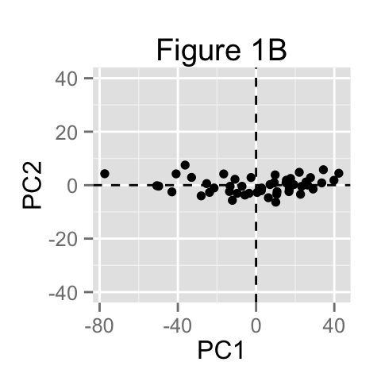

Neat animation showing how PC1 is fit, with the data projected onto possible eigenvectors. You can see that the best PC1 minimizes the distance between the points and the vector: 

 
 

  
This can extend to many dimensions. 


##Real world uses:
Can measure a bunch of different ecological traits in closely related species, and see whether any can be reliably used to distinguish between the species:  

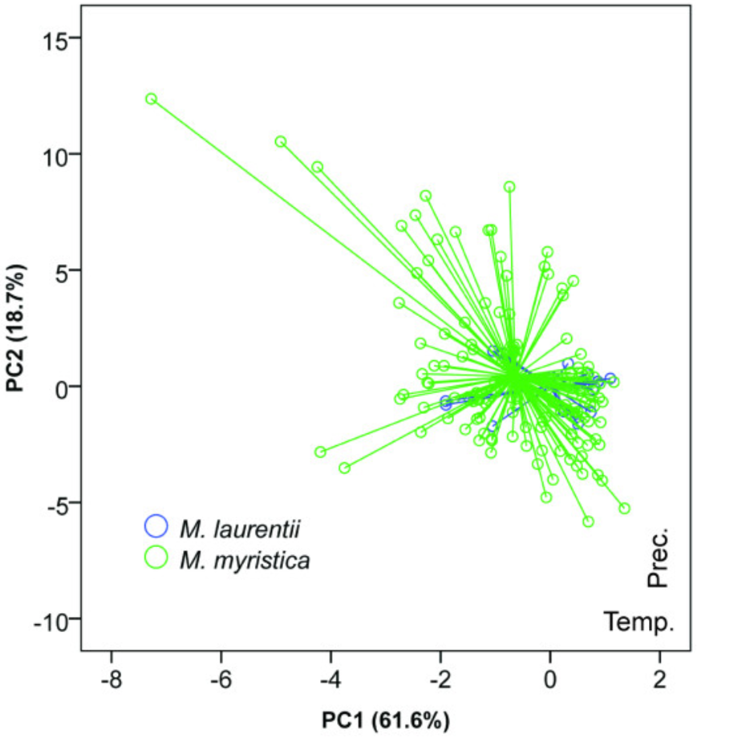
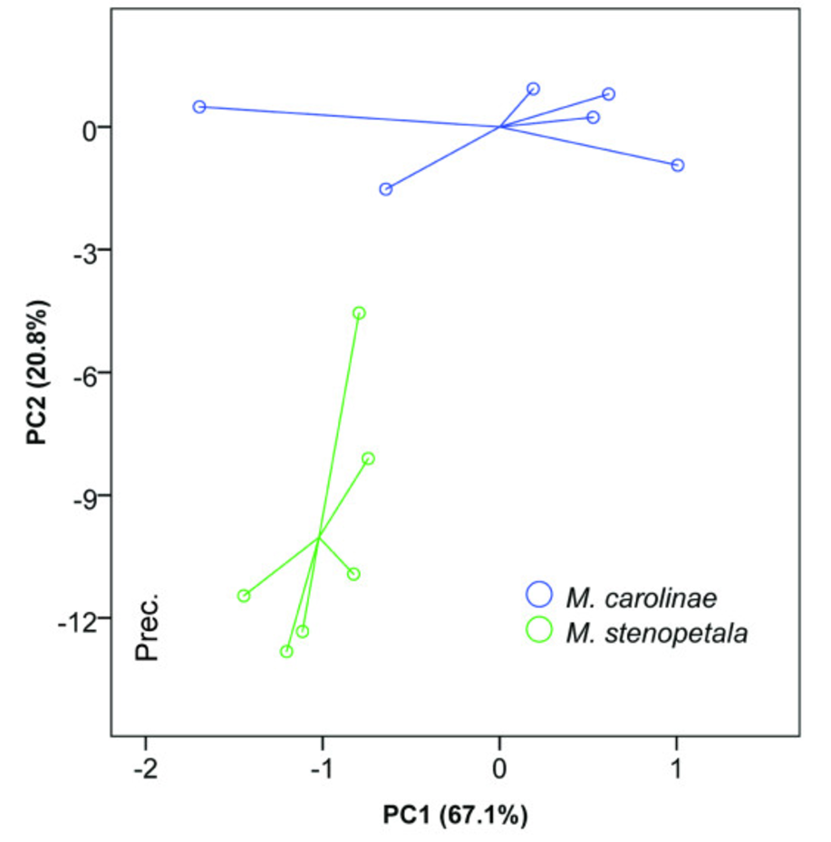   
   
> In: Courvreur T. P., Porter-Morgan H., Wieringa J. J., and Chatrou, L. W. Little ecological divergence associated with speciation in two African rain forest tree genera. BMC *Evolutionary Biology*. 2011, 11(296). 

Or, you could predict the route that a species will evolve towards an adaptive peak, based on the existing variation in the population:   


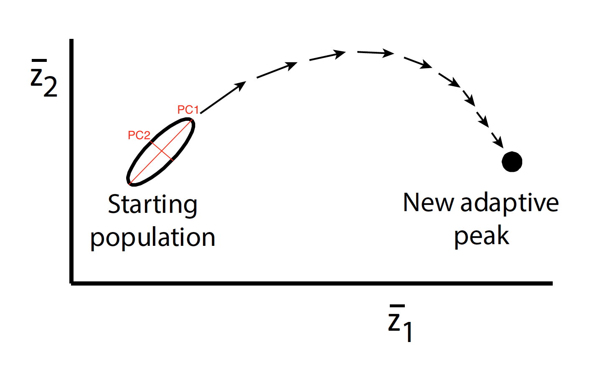
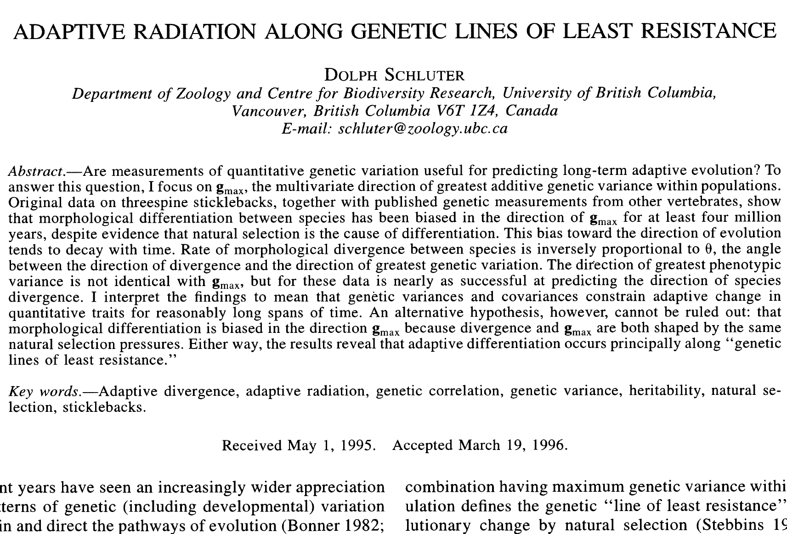     

> In: Schluter, D. Adaptive radiation along genetic lines of least resistance. *Evolution*. 1996, 50(5).   

   
So, now that we've worked thorugh a toy model, let's get into the math:

### Some Background Mathematics...


To understand what Principal Component Analysis (PCA) actually does, we need to remember some basics background mathematics. This might be quite simple, and a lot of what we have done in class will show up again, but it will help to understand the process of PCA.

Things you need to remember throughout this module are:

- Variance
- Covariance and Covariance Matrix
- Correlation Matrix
- Eigenvalues/ Eigenvectors


#### 1) Variance
Besides Standard deviation, variance is another measure of how spread out out a dataset is. In fact, it is almost identical to the standard deviation. It simply is the standard deviation squared. R has a build-in functon called var(), and we have derived Variance in earlier sections of this course. We will need this information to cover the next section, covariance.

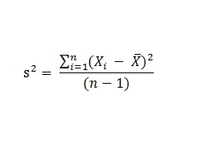

```{r}
x1<-c(0,8,12,20)
x2<-c(8,9,11,12)
Results<-cbind(mean(x1), mean(x2),var(x1), var(x2))
colnames(Results)<-c("Mean X1", "Mean X2", "Var X1", "Var X2")
Results
```


#### 2) Covariance
SD and Variance are purely one-dimensional. Examples are for instance heights of all monkeys in a cage, or armlength of all students in this room. However throughout this course we have repeatedly seen datasets with more than one dimension. Usually the aim of our analysis is to describe relationships between those dimensions. For instance our dataset includes the height of all monkeys but also the arm lenght, and we want to find out how related those dimensions are. Covariance is a simple way to find out how dimensions vary from the mean with respect to each other. Again, R has a build in function cov().

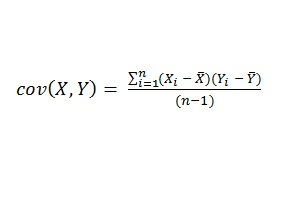

```{r}
cov(x1,x2)
```

Recall that covariance is measured between two dimensions. If we have a dataset with more than two dimensions there is more than one covariance measurment that can be calculated. An example is a three dimensional dataset with dimensions x, y, z. In this scenario we can calculate cov(x,y), cov(x,z), cov(z,y). If we calculate all the possible combinations of covariance between the dimensions, and put them in a matrix, we obtain a covariance matrix (again we can simply use the cov() function for this).


```{r}
x<-c(1,3,6,4)
y<-c(30,20,10,18)
z<-c(0.3,0.7,0.5,0.4)
M<-cbind(x,y,z)
cov(M)
```
However, there are some problems with covariance: 

- Covariances are hard to compare! For instance if you calculate covariance of a set of heights and weights (in meters and kilograms, respectively), you will get a different covariance when you use other units (e.g you use the imperial system instead of the metric system). 

- Differences in scale will flaw the covariance matrix. For instance we have a variable in our dataset describing the body length of a whale, and one describing the diameter of its smallest tooth. Covariance between those two variables will be hard to interpret.

This is why we have a tool to normalize covariance matrices... 


#### 3) Correlation matrices

The correlation matrix divides the covariance matrix by something that represents the diversity and scale in the covariates ,and provides a new value, a correlation. This correlation lays between -1 and 1. E.g for the correlation between variable x and y, we divide its covariance by the square root of the variance of x times the variance of y. 

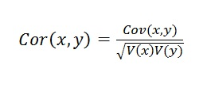

Again, we luckily don't have to do this by hand. R has a build-in function cor(). 
```{r}
cor(x,y)
```

And again, if we perform this operation on more than two variables, cor() will also create a correlation matrix for you.

```{r}
cor(M)
```


#### 4) Eigenvectors and Eigenvalues. 

Imagine we are doing Matrix multiplication. Specifically we are multiplying a matrix with a vector (or in math jargon, we "transform" a vector using a matrix). If the resulting vector is an integer of the original vector, we call the original vector an EIGENVECTOR. The number we have to multiply the original vector with to obtain the resulting vector, is called its EIGENVALUE. The matrix functions as a transforming element, "stretching" the vector without changing its direction. Sounds confusing, let's dive into vector space and see if we can make it easier to understand.

Non-eigenvector

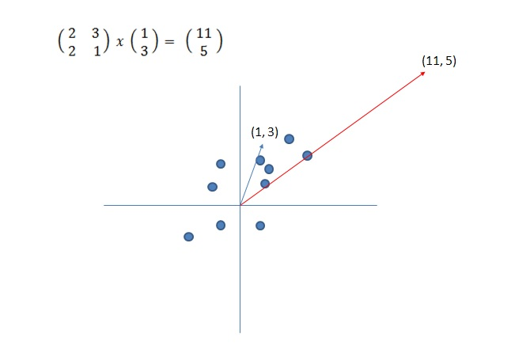

This shows that we if we take a random vector, transformation with the covariance/correlation matrix of the dataset will move this vector in both, direction and length. Interestingly, if we would now use the correlation matrix to transform the resulting vector again and again, the slope and direction would start to stabilize. 

And than there are those magical eigenvectors:

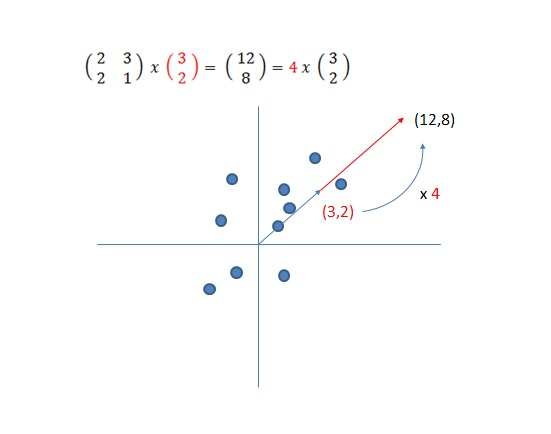

Transformation of this vector by the covariance matrix does not result in directional changes. Instead it only influences the length of the vector. You see that the resulting vector is an integer of the Eigenvector multiplied by a certain number (4 in our case). This is the Eigenvalue of the Eigenvector, and is pretty much a measure of data spread! Note that together, Eigenvectors and their corresponding Eigenvalue represent direction and spread that explain variance in our dataset!


Important things to remember about Eigenvectors

- Eigenvectors can only be found for square matrices.
- Given a n x n matrix there will usually be n eigenvectors. E.g. a 3 x 3 matrix has three Eigenvectors.
- Even if an Eigenvector is scaled before throwing it in in the transformation, it will still yield the same Eigenvalue! 
- All Eigenvectors are perpendicular. This means they are at right angles to each other, and we can express data in terms of them!

Well, how would one find those magical Eigenvectors? It is only easy(ish) if you have small matrix. With larger matrices, complicated iterative methods come into play, which are beyond of what we want to cover today --> Today we will use R, and its eigen() function (:


### Alright, with this knowledge we should be ready to go and learn a little bit more about PCA. PCA follows a fairly simple and straightforward recipe:


#### 1) Get some data (or in our case make some up).

We will only use two dimensions in this example, so we can plot the data at each step to visualize what the PCA does. Imagine we went to a bat cave and we measured eyesize and nostrile size of individuals from different species. If you examine the dataset, you will see that both columns (eyesize and nostril size) are in the same scale/unit. This is important because It will determine if we can use the covariance matrix, or if we have to calculate the correlation matrix in upcoming transformation steps (more later!). In this case we can use the covariance matrix for transformation.


```{r}
# create a dataset
Bat.eyesize<-c(2.5,0.5,2.2,1.9,3.1,2.3,2,1,1.5,1.1)
Bat.nostrils<-c(2.4,0.7,2.9,2.2,3.0,2.7,1.6,1.1,1.6,0.9)
Bat.species<-c("Desmodus","Pipistrellus", "Desmodus", "Noctula", "Vampyrum", "Desmodus", "Noctula", "Pipistrellus", "Noctula", "Pipistrellus")
Dataset<-cbind(Bat.species,Bat.eyesize,Bat.nostrils)
Dataset<-as.data.frame(Dataset)
Dataset$Bat.eyesize<-as.numeric(Bat.eyesize)
Dataset$Bat.nostrils<-as.numeric(Bat.nostrils)
head(Dataset)


# let's just plot it for fun
library(ggplot2)
p<-ggplot(Dataset, aes(x=Bat.eyesize, y=Bat.nostrils, color=as.factor(Bat.species)))
p<-p+geom_point(size=4)
p<-p+labs(y="Bat nostril size (cm)", x= "Bat eyesize (cm)")
p<-p+theme_bw()
p<-p+theme(legend.title=element_blank())
p
```


#### 2) Centering of the data by substracting the mean

For a PCA to work properly, we have to substract the mean from each of the data dimensions. This will put the origin 0 in the center of our "data cloud", it will center it. We will add the adjusted values to the original dataset in the first part of the code, and then plot the data to see how things have changed.  

```{r}

Dataset$Bat.eyesize.adjust<-(Dataset$Bat.eyesize-mean(Dataset$Bat.eyesize))
Dataset$Bat.nostrils.adjust<-as.numeric((Dataset$Bat.nostrils-mean(Dataset$Bat.nostrils)))
head(Dataset)

p<-ggplot(Dataset, aes(x=Bat.eyesize.adjust, y=Bat.nostrils.adjust, color=Bat.species))
p<-p+geom_point(size=4)
p<-p+coord_fixed()
p<-p+labs(y="Bat nostril size", x= "Bat eyesize")
p<-p+theme_bw()
p<-p+theme(legend.title=element_blank())
p<-p+geom_vline(xintercept=0)
p<-p+geom_hline(yintercept=0)
p
```


#### 3) Calculate the covariance matrix. 

Again this is pretty simple using the cov() function in R. Since the data is two dimensional, the covariance matrix will be 2 x 2. Remember here that if our dataset includes different scales/units, we have to calculate the correlation matrix instead, which is defined by the cor() function. 

```{r}
covM<-cov(Dataset[,c(2,3)]) # Only picking the original values from the Dataset
covM
```

Note that the non-diagonal elements in the covariance matrix are positive, we should expect that both x and y increase together (which they actually do)!


#### 4) Calculation of Eigenvectors and Eigenvalues

Next, the PCA will calculate the Eigenvectors and Eigenvalues of our Covariance matrix. We can use the build-in function eigen() for this process. As said before, the calculations get very complicated. Especially once the dimensionality of the matrix increases. For visualization we will extract the Eigenvectors, and plot them as directional lines with our data (this will prove that the eigenvectors describe the direction of data spread).

(Since we have two points for each Eigenvector (origin (0,0) and its actual value), we can calculate the slope! It is simply the ratio of the Eigenvector. 


```{r}
Eigen<-eigen(covM)
Eigen$slopes[1]<-Eigen$vectors[1,1]/Eigen$vectors[2,1]
Eigen$slopes[2]<-Eigen$vectors[1,2]/Eigen$vectors[2,2]
head(Eigen)

p<-ggplot(Dataset, aes(x=Bat.eyesize.adjust, y=Bat.nostrils.adjust, color=Bat.species))
p<-p+geom_point(size=4)
p<-p+coord_fixed()
p<-p+labs(y="Bat nostril size", x= "Bat eyesize")
p<-p+theme_bw()
p<-p+theme(legend.title=element_blank())
p<-p+geom_vline(xintercept=0)
p<-p+geom_hline(yintercept=0)
p<-p+geom_abline(intercept = 0, slope = Eigen$slopes[1], colour = "green")  
p<-p+geom_abline(intercept = 0, slope = Eigen$slopes[2], colour = "red")
p
```

If you look at the plot, you can see that the data has quite a strong pattern. As expected from the covariance matrix, the two variables do indeed increase together. The plot also shows the two Eigenvectors which are perpendicular to each other. One goes through the middle of the points, like drawing a line of best fit (green)! This Eigenvector is showing us the direction and spread that explains the biggest variance in our dataset. The second Eigenvector (red) gives us the other, less important direction/spread that explains the second biggest variance in our dataset. Since we have two dimensions, we have two eigenvectors. 


#### 5) Choosing principal components

The Eigenvector with the highest eigenvalue is also called the first principle component of the data set (PC 1). In our example it is represented by the green line. It is the most significant relationship between the data dimensions. Therefore in the next step the PCA orders the Eigenvectors by Eigenvalue from highest to lowest (again, remember the Eigenvalue is pretty much a measure of data spread), and we can decide to ignore components of lesser significance. This process is called creating a feature vector. If you leave components out, the final dataset will have less dimensions than the original one! There are several diagnostic tools for visual PC selection, and we will talk about one of them later. 

Below you will see how we picked both eigenvectors (PC 1 and 2) from our result derived with the eigen() function. 

```{r}
feat.vec<-Eigen$vectors
feat.vec
```


#### 6) Deriving the new data set (PCA scores), projecting the data to the new dimensions 
This is the final step in the PCA, the calculation of our PCA scores. We have choosen the components that we wish to keep in our data, and formed a feature vectors. We now take the transpose of the feature vector and multiply it on the left of the original data set (also transposed).


```{r}
feat.vec.tr<-t(feat.vec)
feat.vec.tr
row_data_adj<-t(Dataset[,4:5])
PCA_scores<-data.frame(t(feat.vec.tr%*%row_data_adj))
names(PCA_scores)<-c("x", "y")
PCA_scores
Dataset<-cbind(Dataset,PCA_scores)
```

First, lets see what happens if we plot both eigenvectors (both principal components)
In this case we keep both dimensions.
```{r}
p<-ggplot(Dataset, aes(x=x, y=y, color=as.factor(Bat.species)))
p<-p+geom_point(size=4)
p<-p+labs(y="Principal Component 2", x= "Principal Component 1")
p<-p+theme_bw()
p<-p+theme(legend.title=element_blank())
p<-p+geom_vline(xintercept=0, color="red")
p<-p+geom_hline(yintercept=0, color="green")
p
```

Now, we can see what happens if we remove the second, less significant principal component. 
```{r}
Dataset$m<-rep(0,10) # adding a column of zeros merely for plotting purposes. 
head(Dataset)

p<-ggplot(Dataset, aes(x=x, y=m, color=as.factor(Bat.species)))
p<-p+geom_point(size=4)
p<-p+labs(x="Principal Component 1")
p<-p+theme_bw()
p<-p+theme(legend.title=element_blank(), axis.title.y=element_blank(), axis.text.y=element_blank())
p<-p+geom_hline(yintercept=0, color="green")
p
```

The second plot is mainly eyecandy, it is just a number line because we want to demonstrate that we compressed the dataset from two to one dimension without loosing too much information. We got rid of one uneccessary dimension because the variance it contributed to the data was insignificant! Hooray, the PCA did its job! 

Now this was quite a hustle, and included a lot of steps. Luckily R has build-in functions for these kind of analysis:

Here is an example of a dataset in the HSAUR package in R (Handbook of Statistical Analysese Using R) of athletes from different countries that compete in a heptathlon. In this dataset we can see here that there are seven different events that each athlete is ranked on. 


```{r}
# If you haven't already, install this package:
#install.packages("HSAUR")#need to install this package
library(HSAUR) 
head(heptathlon, n=10L)
```

When doing multivariate analyses, we want to know whether any of our variables behave in similar ways. From this we can figure out what processes govern the distribution of these samples. 

For this example, we want to know whether being good in any one event is a predictor for how you will do in the other events. With this data, we can first look at pairwaise scatter plot to get an overall idea of how the variables are correlated with one another. 

```{r}
hep<-heptathlon[,-8] #remove the scores from the dataset in column 8
pairs(hep)
```

We can see that most of these variable are highly correlated to one another and thats when we want to do PCA to try and reduce the dimensionality. Before we can run the PCA, we must choose whether we want to use the correlation matrix or the covariance matrix. The covariance matrix centers each variable on the mean but the scale of the variable still matters. Variables that originally had really high varaiance will control the resulting PCA plot much more strongly. Variables that had tiny variance will be unimportant. *Should only use the covariance matrix when all of the variables are in comparable units and the differences between their original variances are meaningful for interpretation. The correlation matrix uses the correlation coefficents. This adjusts each variable so it is centered around the mean and standardized to a variance of 1. 

In this example, we can see that some of the events, such as high jump, have average value of 1.8, whereas the 800m run has an average of 120. Because of this, it makes sense to use the correlation matrix. This is the more common assocation matrix for PCA and differentiating between the two can be important for interpretation (we can run both in this example to show the difference).


SO, let's run the PCA:

In the base package in R
There are two base functions in R for running a PCA: 
there is prcomp() and princomp() that more or less give you the same thing

Here is an example with prcomp:
```{r, echo=TRUE}
PC.hep.cor<-prcomp(hep, scale=TRUE) #using the correlation matrix
print(PC.hep.cor)
#scale=TRUE bases the PCA on the corrlation matrix

PC.hep.cov<-prcomp(hep, scale=FALSE) #using the covariance matrix
print(PC.hep.cov)
#scale=FALSE bases the PCA on the covariance matrix
```

There can be as many principle components as there are variables, but the goal of this technique is to simplify! To figure out how many principal components to include in your analysis, a common technique is to use a scree plot. This show the proportion of variance explained by each component. There are several rules-of-thumb for figuring out how many components to include. Can either have some threshold of components required to explain a majority of the variance (typically ~80%) OR ignore any component that explains less than 1% of the variance. Most people just use the first two or three.

```{r, echo=TRUE}
plot(PC.hep.cor)
summary(PC.hep.cor) #proportion of variance is the eigenvalue for each PC. We can see that 95% of our data is explained with the first four, but 81% is explained.
```


So, if we continue with the first two principal components, we can look how the data fall out. The black lines are each individual athlete and the red lines tell us which variable, or sporting event, is aligning on each component.
```{r, echo=TRUE}
biplot(PC.hep.cor)
```

We can also look at the biplot for the covariance matrix to compare.
```{r}
biplot(PC.hep.cov)
```


Loadings are the correlations between the original variales and the axis. They indicate the direction and magnitude of the icnrease in that variable.The higher the component loading, the more important that variable is to the component. 
```{r, echo=TRUE}
#here is the same example wtih princomp
pc.hep.cor<-princomp(hep, scores=TRUE, cor=TRUE)
#first argument is the dataset, second argument scores=TRUE which means that it will take the data and transform it into the reduced space; the third variable specifies to use the correlation matrix and not the covariance matrix to do this (same as scale=TRUE in the other function.)

summary(pc.hep.cor)
summary(PC.hep.cor)
#you can see that the outputs for these are almost idential. i.e. it doesnt matter which function in the base R package you use.

pc.hep.cor$loadings
```

Here is another example using the base package in R:   
```{r, echo=TRUE}
pottery
pairs(pottery)
pot.pc<-princomp(pottery, scores=TRUE, cor=TRUE)

pot.pc$loadings
pot.pc$scores

plot(pot.pc)
biplot(pot.pc)

```


      Some further helpful resources:
      3D visualization tool:
      http://setosa.io/ev/principal-component-analysis/
      http://stats.stackexchange.com/questions/2691/making-sense-of-principal-component-analysis-eigenvectors-eigenvalues
      
      Image credits: 
      http://www.sthda.com/english/wiki/principal-component-analysis-the-basics-you-should-read-r-software-and-data-mining
      Kirkpatrick, Mike. Population Genetics Lecture QT#2
      stackoverflow user "amoeba": http://stats.stackexchange.com/questions/2691/making-sense-of-principal-component-analysis-eigenvectors-eigenvalues
    
    